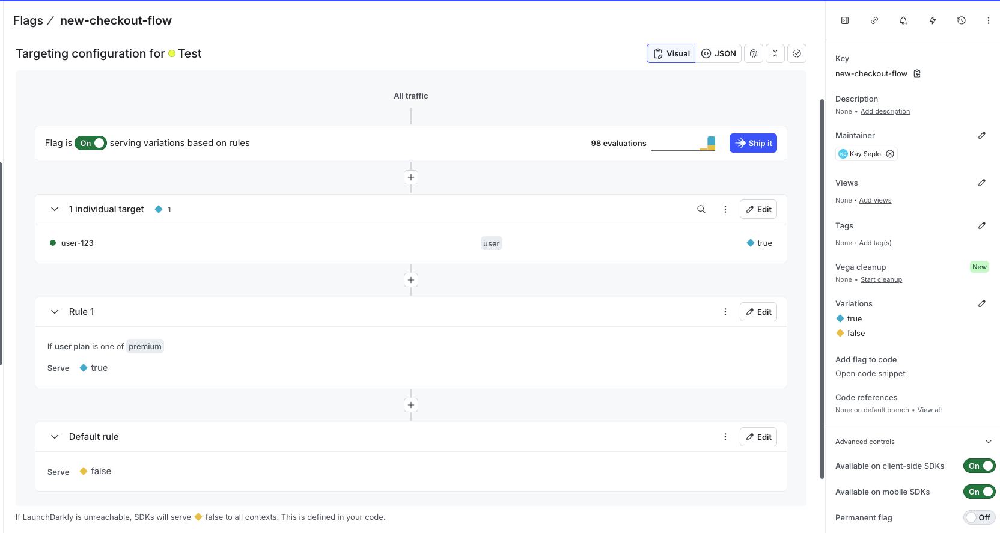
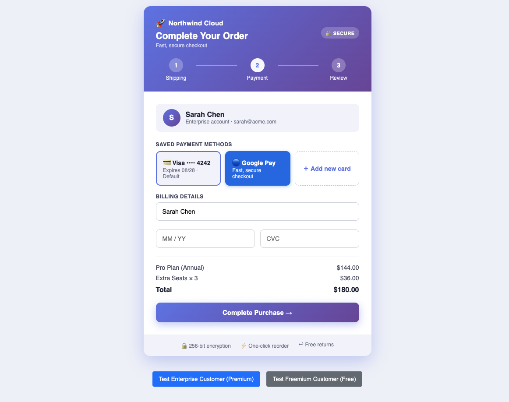
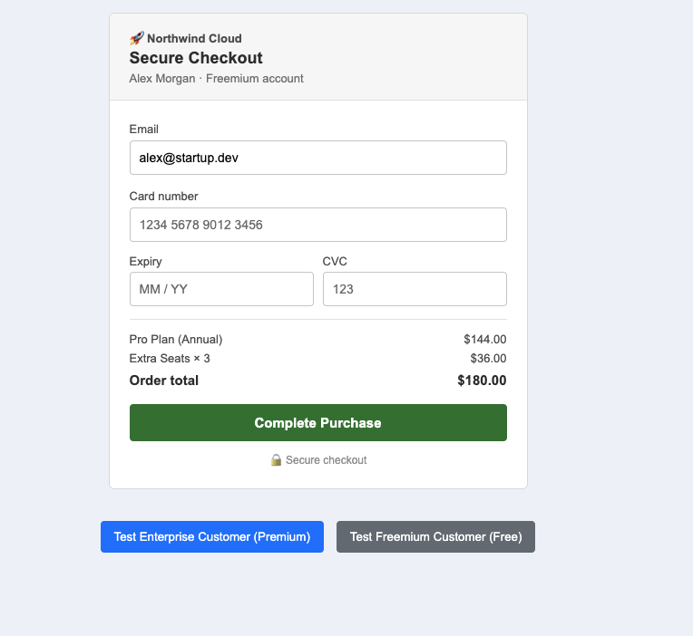
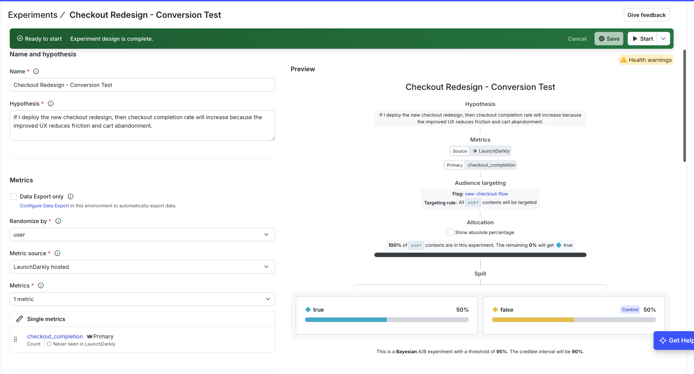

# LaunchDarkly SE Technical Exercise
 
A demonstration of LaunchDarkly feature flags with real-time targeting, showcasing safe feature releases and targeted user experiences.
 
## Overview
 
This project demonstrates two core LaunchDarkly capabilities:
 
### Part 1: Release & Remediate
- **Feature Flags**: Toggle features on/off without redeployment
- **Instant Updates**: Real-time flag changes with SDK listeners (no page reload required)
- **Safe Rollback**: Quickly disable problematic features with zero downtime
### Part 2: Target
- **Individual Targeting**: Enable features for specific users
- **Rule-Based Targeting**: Target users based on custom attributes (plan, company size, etc.)
- **Real-World Scenarios**: Demonstrates targeting enterprise vs. freemium customers
## Quick Start
 
### Prerequisites
- Node.js 16+ and npm
- LaunchDarkly account (free trial at https://launchdarkly.com/start-trial/)
### Setup
 
1. **Clone and install dependencies**
```bash
git clone https://github.com/kaylaseplo/launchdarkly-demo.git
cd launchdarkly-demo
npm install
```
 
2. **Get your LaunchDarkly SDK key**
   - Log in to your LaunchDarkly account
   - Go to Settings → Environments → SDK keys
   - Copy your **Client-side ID** for the Test environment
3. **Update the SDK key in `app.js`**
   - Replace `'6a6a6f71c0abbe0a98ecd74e'` with your actual Client-side ID (line 32)
4. **Start the dev server**
```bash
npm run dev
```
 
5. **Open your browser**
   - Navigate to `http://localhost:1234`
## How to Use
 
### Testing Part 1: Release & Remediate
 
1. **Click "Test Enterprise Customer"** to load an enterprise user
2. You should see: **"✅ New Checkout Flow (ENABLED)"**
3. Go to LaunchDarkly dashboard → Flags → `new-checkout-flow`
4. **Toggle the flag On/Off** — watch your app update instantly (no reload needed)
5. This demonstrates safe feature releases and instant rollback
### Testing Part 2: Target
 
1. **Click "Test Enterprise Customer"** (plan: premium)
   - Should see: **ENABLED** (matches Rule 1: if plan === 'premium')
2. **Click "Test Freemium Customer"** (plan: free)
   - Should see: **DISABLED** (falls to default rule: false)
3. Go to LaunchDarkly dashboard to see how the targeting works:
   - **Individual Target**: user-123 always gets `true`
   - **Rule 1**: if user plan is 'premium' → serve `true`
   - **Default Rule**: serve `false` to everyone else
## Feature Flag Configuration
 
The `new-checkout-flow` flag is configured in LaunchDarkly with:
 
**Targeting Rules:**
- Individual target: `user-123` → `true` (always enabled for this user)
- Rule 1: if `user.plan` is one of `'premium'` → `true`
- Default rule: → `false`
**Context Attributes Used:**
- `plan` (free/premium) — determines feature access
- `accountType` (Freemium/Enterprise) — for display
- `companySize` (small/large) — example custom attribute
## Screenshots
 
**Flag Configuration in LaunchDarkly Dashboard**

- Shows individual targeting, rule-based targeting, and default fallback
**Enterprise Customer (Premium) - Feature ENABLED**

- Sarah Chen sees the new checkout flow with premium styling, progress indicators, and Google Pay integration
- Matched by: Rule 1 (plan === 'premium')
**Freemium Customer (Free) - Feature DISABLED**

- Alex Morgan sees the standard checkout flow with minimal styling and basic card form
- Falls through to default rule (false)
**Experimentation Setup**

- A/B test configuration with 90/10 treatment/control split for premium users
## Code Structure
 
```
launchdarkly-demo/
├── app.js              # Main LaunchDarkly SDK integration
├── index.html          # Simple UI with buttons to test scenarios
├── package.json        # Dependencies (LaunchDarkly SDK, Parcel)
├── README.md           # This file
└── TALK_TRACK.md       # Presentation script and talking points
```
 
### Key Code: Flag Evaluation
 
```javascript
// Evaluate the flag and update UI
const flagValue = client.variation('new-checkout-flow', false);
updateFeature(flagValue, context);
 
// Listen for real-time changes
client.on('change:new-checkout-flow', () => {
  const flagValue = client.variation('new-checkout-flow', false);
  updateFeature(flagValue, context);
});
```
 
## What This Demonstrates
 
✅ **Feature flag fundamentals**: Toggling features on/off safely  
✅ **Instant rollback**: Disable features without redeployment  
✅ **Individual targeting**: Enable features for specific users  
✅ **Rule-based targeting**: Target based on user attributes  
✅ **Real-time listeners**: Updates without page reloads  
✅ **Production-ready patterns**: Context attributes, flag evaluation, error handling
 
## Next Steps (Extra Credit)
 
To extend this project:
- **Experimentation**: Create A/B tests with metrics
- **AI Configs**: Manage LLM prompts and models via feature flags
- **Integrations**: Connect to Slack, DataDog, or other services
## Notes
 
- The SDK key shown is for demonstration only and has limited scope
- This uses LaunchDarkly's free trial account
- The app runs entirely client-side (no backend required)
- Flag values are evaluated locally by the SDK for performance
## Resources
 
- [LaunchDarkly Documentation](https://docs.launchdarkly.com/)
- [JavaScript SDK Guide](https://docs.launchdarkly.com/sdk/client-side/javascript)
- [Feature Flags Best Practices](https://launchdarkly.com/blog/)
## Contact
 
Questions? Reach out to the LaunchDarkly team or check their support docs.